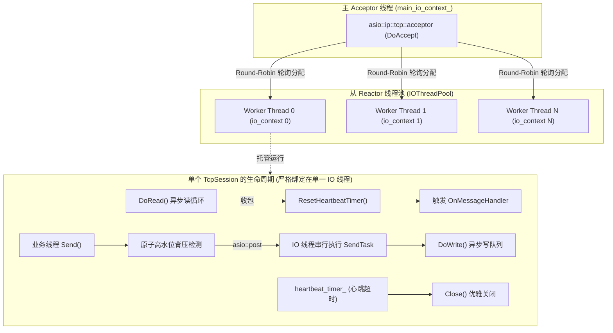
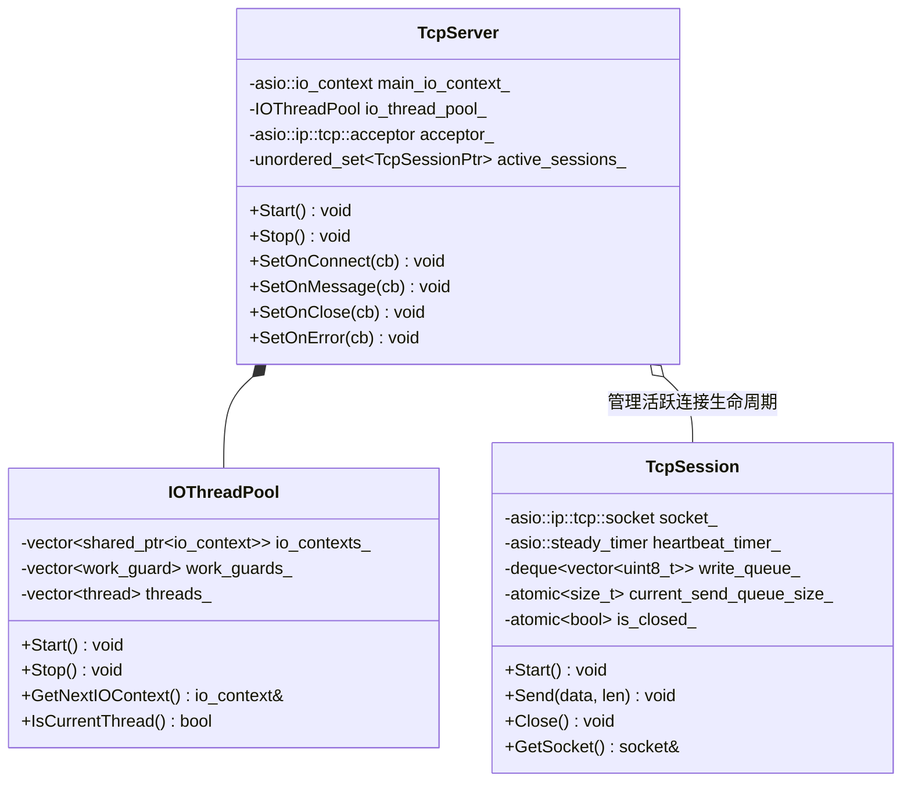
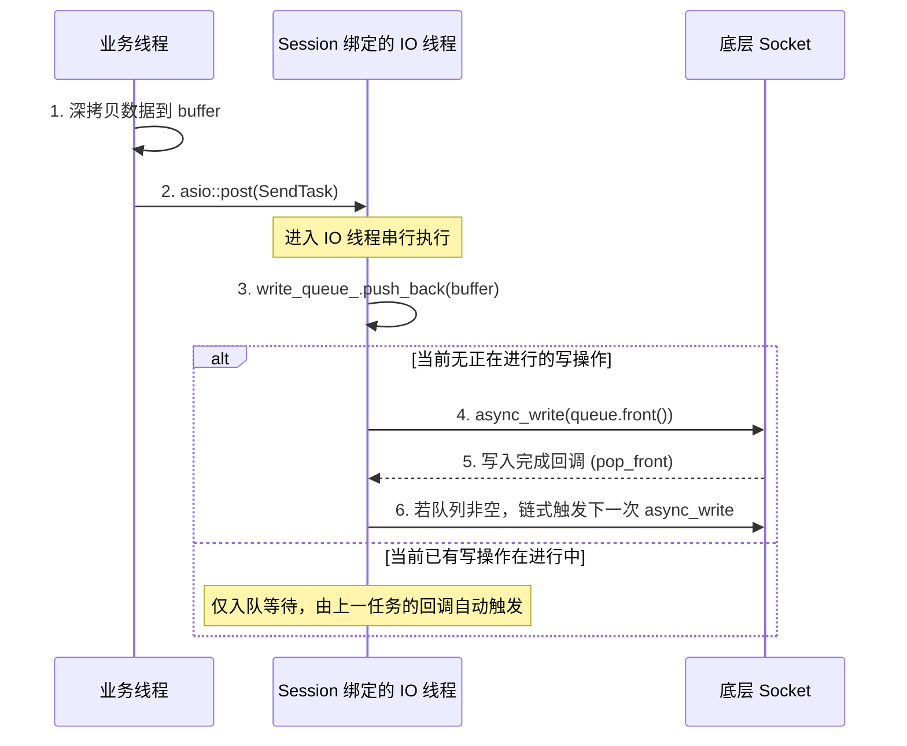
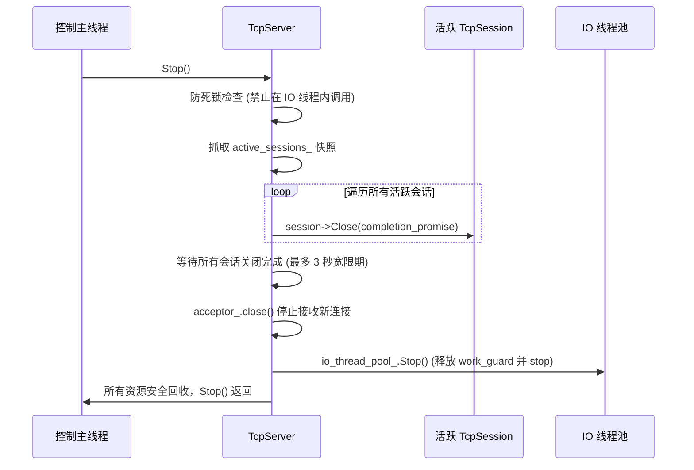
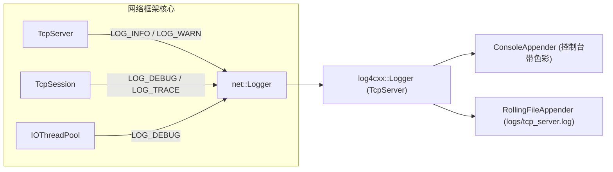

# C++11 TCP Server 架构与设计文档

本文档详细介绍了基于 C++11 和 **Standalone Asio** 构建的高性能 TCP 服务端的设计理念、线程模型、核心状态机机制、并发控制以及优雅停机流程。

---

## 1. 架构概览与线程模型

本项目采用业界标准的高性能网络并发模型 —— **主从 Reactor 模式（One Loop Per Thread）**。



### 1.1 线程角色划分
1. **主 Reactor 线程（Acceptor Thread）**：
   - 拥有独立的 `main_io_context_`。
   - 仅负责监听套接字（`acceptor_`）的 `async_accept` 事件，确保新连接接入不被任何繁重的读写业务阻塞。
2. **从 Reactor 线程池（IO Worker Threads）**：
   - 线程池内每个线程拥有独立且唯一的 `io_context` 实例。
   - 彼此**无锁竞争**，独立进行 `epoll/kqueue` 事件轮询。
   - 新建连接通过轮询（Round-Robin）分配到某个 `io_context` 上，后续该连接的所有读、写、心跳定时器事件都在该特定线程内串行执行。

---

## 2. 核心组件与职责



### 2.1 `IOThreadPool`（IO 线程池）
* **WorkGuard 机制**：每个 `io_context` 初始化时绑定一个 `executor_work_guard`，保证在没有网络连接时工作线程也不会退出 `run()`。
* **优雅停止**：`Stop()` 阶段首先 `reset()` 释放 WorkGuard，然后显式调用 `stop()` 强行唤醒阻塞中的线程，最后逐个 `join()` 回收。

### 2.2 `TcpSession`（TCP 会话状态机）
* 继承自 `std::enable_shared_from_this<TcpSession>`，封装单个客户端连接的完整生命周期。
* 内置异步读循环（`DoRead`）、链式发送队列（`DoWrite`）、原子背压流量控制和空闲心跳检测（`heartbeat_timer_`）。

### 2.3 `TcpServer`（服务端管理器）
* 管理主监听套接字与线程池生命周期。
* 持有 `active_sessions_` 全局活跃会话集合，提供停机时的会话快照与排空等待机制。

---

## 3. 关键机制与并发安全设计

### 3.1 异步生命周期管理（彻底杜绝 Use-After-Free）
* **痛点**：在异步网络编程中，如果发起 `async_read` 或 `async_write` 后对象被上层析构，回调执行时访问成员变量会引发崩溃。
* **解决**：在发起每个 Asio 异步调用时，通过 `auto self = shared_from_this();` 将自身的引用计数传递给 Lambda 闭包。只要内核还有挂起的 I/O 操作，`TcpSession` 对象就绝对不会被释放。

```cpp
// 典型的生命周期绑定范式
void TcpSession::DoRead() {
    auto self(shared_from_this()); // 引用计数 +1，确保回调返回前 Session 绝不析构
    socket_.async_read_some(asio::buffer(read_buffer_),
        [this, self](const std::error_code& ec, std::size_t bytes_transferred) {
            // 回调执行期间对象安全存活
        });
}
```

---

### 3.2 并发发送与任务串行化（解决 Asio 并发写 UB）
* **痛点**：Asio 底层规定在同一个 socket 上并发发起多个 `async_write` 是未定义行为（UB）。
* **解决**：
  1. `Send()` 接口开放给任意外部业务线程；
  2. 构造 Session 时缓存 socket 的 executor，内部通过 `asio::post(executor_, ...)` 将发送任务投递到绑定的单一 IO 线程中，避免业务线程访问共享 socket；
  3. 在 IO 线程内维护 `write_queue_`，严格保证上一个 `async_write` 完成触发回调后，才发起下一次 `async_write`。
  4. 多个业务线程并发调用 `Send()` 时只保证写操作不会重叠，不承诺这些调用之间的全局发送顺序；需要严格顺序的协议应在业务层编号或统一投递。



---

### 3.3 发送背压与防 OOM 水位控制（Backpressure）
* **痛点**：当客户端网络极慢（或恶意不读取数据），而服务端高频调用 `Send()` 时，发送队列会无限膨胀，最终导致服务端内存溢出（OOM）。
* **解决**：
  - 引入 `current_send_queue_size_`（原子计数）和 `max_send_queue_size_`（默认 10MB）。
  - 每次 `Send()` 时通过 `fetch_add` 累加待发送字节数。如果超出阈值，立即回滚计数并主动切断连接（`Close()`）。
  - 数据拷贝、任务投递、入队或异步写失败，以及关闭期间丢弃待发送数据时，都会回收对应计数。

---

### 3.4 优雅停机与排空机制（Graceful Shutdown）
服务端关闭（`TcpServer::Stop()`）遵循严格的时序保证：



---

## 4. API 契约与回调规范

| 回调函数 | 触发线程 | 时机与注意事项 |
| :--- | :--- | :--- |
| `OnConnectHandler` | **主 Acceptor 线程** | 新客户端握手成功后触发。回调完成后，会话才会在 IO 线程启动读取。 |
| `OnMessageHandler` | **Session 归属 IO 线程** | 收到新数据时触发。`data` 仅在回调函数返回前有效，如需异步跨线程使用**必须自行深拷贝**。 |
| `OnCloseHandler` | **Session 归属 IO 线程** | 当底层 socket 和定时器完全关闭后触发，**保证每个连接只触发一次**。 |
| `OnErrorHandler` | **Session 归属 IO 线程** | 发生非主动取消的网络异常时触发，随后框架会自动进入关闭流程。 |

---

---

## 5. 日志系统设计 (Apache log4cxx)

为了在保证高吞吐网络 I/O 的同时提供清晰、可追溯的系统运行状态，本项目集成了 **Apache log4cxx** 工业级日志框架，并进行了轻量级 C++11 封装：

### 5.1 设计亮点
1. **printf 风格变参宏**：提供 `LOG_TRACE`、`LOG_DEBUG`、`LOG_INFO`、`LOG_WARN`、`LOG_ERROR`、`LOG_FATAL`，支持任意类型变参格式化。
2. **源码级定位追踪**：基于 `LOG4CXX_LOCATION` 宏，日志自动捕获并输出触发所在源文件、代码行号及函数名称。
3. **零开销级别检测**：日志宏内置 `is*Enabled()` 前置判断，未开启的低级别日志（如生产环境的 TRACE）直接在判断处短路，跳过格式化字符串构造与堆栈展开。
4. **灵活配置与平滑降级**：通过 `net::Logger::Init("log4cxx.properties")` 加载配置；若未配置或配置文件缺失，自动降级至 `BasicConfigurator` 控制台输出，绝不丢日志或引发崩溃。
5. **滚动文件输出**：提供 `log4cxx.properties` 模板，支持最大文件大小切分（如 10MB）与历史备份归档。

### 5.2 统一根 Logger 结构


---

## 6. 快速上手示例

```cpp
#include "net/tcp_server.h"
#include "net/logger.h"

int main() {
    // 0. 初始化日志系统
    net::Logger::Init("log4cxx.properties");

    unsigned short port = 8888;
    int heartbeat_timeout = 30; // 30秒无数据自动断开空闲连接

    // 初始化服务端：4 个工作线程
    net::TcpServer server(port, 4, heartbeat_timeout);

    // 1. 收到数据时 Echo 回显
    server.SetOnMessage([](net::TcpSessionPtr session, const uint8_t* data, std::size_t len) {
        std::string msg(reinterpret_cast<const char*>(data), len);
        session->Send("[Echo] " + msg); // 线程安全发送
    });

    // 2. 客户端连接/断开事件监听
    server.SetOnConnect([](net::TcpSessionPtr s) {
        LOG_INFO("Client connected from %s:%u", s->GetRemoteAddress().c_str(), s->GetRemotePort());
    });
    server.SetOnClose([](net::TcpSessionPtr s) {
        LOG_INFO("Client closed from %s:%u", s->GetRemoteAddress().c_str(), s->GetRemotePort());
    });

    // 3. 启动服务端（非阻塞调用）
    server.Start();

    // 运行...
    // server.Stop(); // 优雅停止
    return 0;
}
```

---

---

## 7. 跨平台与 Windows 适配架构

本项目原生支持 **Linux / Windows / macOS** 跨平台编译与部署，在网络层与编译期进行了细致的兼容性处理：

### 7.1 Windows 网络层与 Winsock 适配
- **底层驱动库**：Windows 平台自动链接 `ws2_32.lib` 与 `mswsock.lib`，由 Asio 自动接管 Windows Sockets 2 初始化与异步 I/O 完成端口（IOCP）或 select 机制。
- **预编译宏隔离**：
  - `_WIN32_WINNT=0x0601`：明确设定目标 API 为 Windows 7 及以上系统，开启完整的 Winsock2 与线程支持。
  - `WIN32_LEAN_AND_MEAN`：剔除 Windows 极少使用的头文件（如 RPC、Crypto、DDE 等），避免命名污染并大幅提升编译速度。
  - `_CRT_SECURE_NO_WARNINGS`：消除 MSVC 对传统 CRT 函数（如 `vsnprintf`）的无谓告警。
- **MSVC 字符集兼容**：开启 `/utf-8` 编译参数，确保包含中文字符的日志输出及源文件在 Windows 终端与 IDE 中均不出现乱码。

### 7.2 包管理与依赖自动发现
- 在 Windows 下，CMakeLists.txt 自动探测并注入 `vcpkg` 工具链路径（支持 `$ENV{VCPKG_ROOT}`、`%USERPROFILE%/vcpkg`、`C:/vcpkg`），支持 `log4cxx` 动静态库（`log4cxx.lib` / `log4cxxs.lib`）的自动定位与链接。

---

## 8. 后续演进建议

1. **应用层协议编解码（Codec）**：建议在 `OnMessageHandler` 上层封装基于固定长度包头（如 4 字节 Payload Length）的 `LengthFieldCodec`，以便处理 TCP 流式通信中的粘包和拆包问题。
2. **高频小包内存池优化**：若面对数百万 QPS 的极端小包场景，可引入环形缓冲区（RingBuffer）或 Slice 内存池减少 `std::vector` 的内存分配开销。
3. **超大规模连接心跳优化**：当连接规模达到 10 万+ 时，可引入**时间轮算法（Timing Wheel）**替代单 Session 独立定时器以降低调度开销。
4. **日志异步刷盘（AsyncAppender）**：极高并发写日志场景下，可在 `log4cxx.properties` 中配置 `org.apache.log4j.AsyncAppender`，将文件 I/O 完全剥离至后台写线程。


